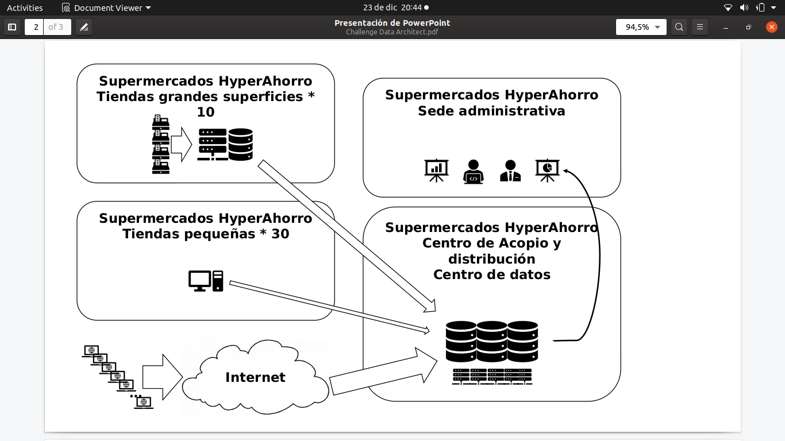
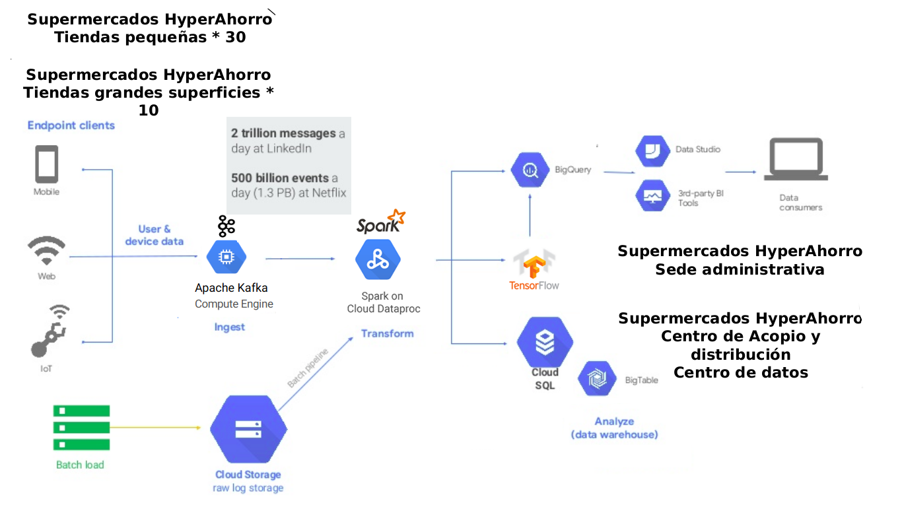

# Arquitectura
Falabella Arquitetura
Software como Serviço (SaaS), 
Plataforma como Serviço (PaaS),
Infraestrutura como Serviço (IaaS).

Arquitectura de nube para datos
Caso de estudio – El Sistema actual
Una cadena de supermercados, que funciona solamente en Santiago, tiene una infraestructura de tecnología on-
premises como la que se muestra en la imagen de la siguiente hoja.
A muy alto nivel está compuesta de:
• Centro de datos localizado en el centro de acopio y distribución donde se mantienen los servidores principales con
bases de datos relacionales Oracle y MS SQL Server, aplicaciones para CRM y ERP de diferentes distribuidores.
• Un rack en cada tienda grande (hay 10 de ellas) con una aplicación desarrollada internamente en .net para
gestionar la actividad de los puntos de venta (POS). Se basa en una instancia MS SQL Server que se sincroniza con
una base de datos idéntica de sólo lectura en el centro de datos. Scripts que se ejecutan cada 15 minutos
descargan archivos planos desde las bases de datos replicadas en el centro y cargan la información a la base de
datos Oracle.
• En cada tienda pequeña, cuentan con una estación Linux con postgress y otra aplicación desarrollada en Java que
funciona directamente como POS. Toda la actualización de los datos es manual. Al final del día, el encargado de la
tienda debe invocar la función para generar un archivo CSV de actualización de inventarios, ventas y mermas y
enviarlo por FTP. En el centro de datos se utilizan programas ETL para cargarlos a la base de datos Oracle
• En la sede administrativa se utilizan diversos programas comerciales para generar tableros de control y gráficos de
tendencias. La gerencia general tiene un ambicioso plan para implantar un equipo de analítica para incrementar la
eficiencia en el control de inventarios y ventas.
• Adicionalmente, están a punto de lanzar una aplicación e-commerce que incrementará el tráfico de transacciones
en un 240% adicional al actual y en épocas especiales puede tener picos superiores a un 650% del trafico promedio
actual.

# Arquitectura de nube para datos
Caso de estudio – El sistema objetivo
El gerente de TI ha alertado que en periodos de vacaciones y festivos las ventas aumentan exponencialmente y
por lo tanto tiene que triplicar su plataforma en el centro de datos. El gerente general entiende las razones pero si
incurre en este costo, los planes para implementar el equipo de analítica se tendrán que aplazar perdiendo una
ventaja estratégica contra la competencia. El gerente de TI propone cambiar a una infraestructura de nube y le
contratan a usted como consultor para definir la arquitectura de la nueva plataforma.
Entendiendo que este es un caso sobre-simplificado, haga cualquier suposición que se requiera para desarrollar los
puntos y haga una lista de estas suposiciones al principio para poder entender su respuesta.
1. Describa una arquitectura de alto nivel (máximo 1 página) sobre una de las plataformas de nube más populares
(AWS, GPC, Azure), mencione si está buscando una solución IaaS, PaaS o SaaS o híbrida, y mencione las 4
ventajas contra la arquitectura de centro de datos on-premise de dicha arquitectura y 4 desventajas u
oportunidades de mejora perdidas de dicha arquitectura para cada una de las siguientes estrategias (enfóquese
en la arquitectura final objetivo y no se preocupe por los temas de transición, compatibilidad, migración y otros
pasos intermedios):
– Estrategia 1: Se busca cambiar la plataforma en el menor tiempo posible, minimizar el entrenamiento del equipo a cargo del
soporte y administración de la plataforma y no modificar el software asociado.
– Estrategia 2: Se busca la mayor eficiencia posible a largo plazo y la gerencia entiende que esto puede requerir mayores costos
y tiempos iniciales pero están dispuestos a hacer una transformación digital completa.
2. Defina una plataforma de nube inicial para Business Intelligence y analítica para que un grupo de 1 Data
Scientist, 2 Data Analysts y 1 Data Engineer puedan iniciar la creación de tableros de control y modelos
predictivos de ventas e inventario. Indique como será la transferencia de datos desde el Sistema central a la
plataforma de BI & Analítica.

